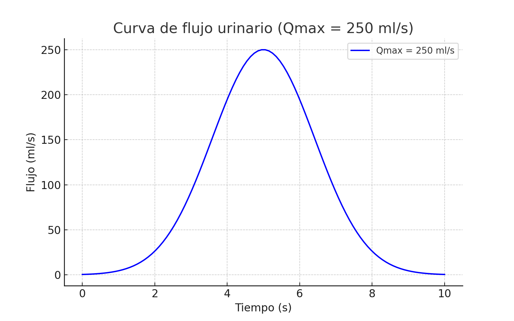
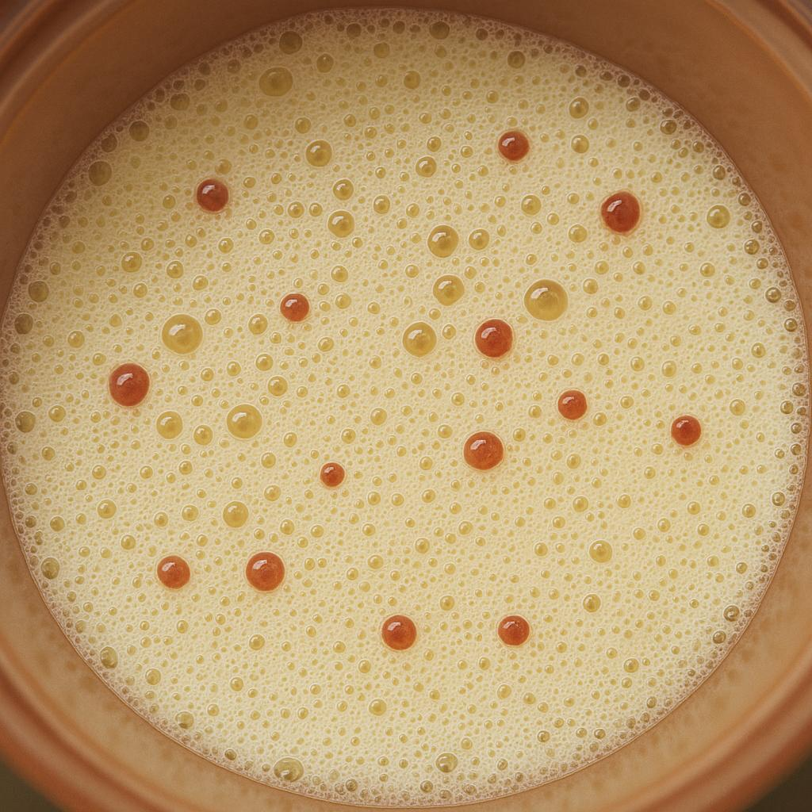

# 🔬💧 Dispositivo de Monitoreo No Invasivo de Parámetros en Orina

Este repositorio contiene el código fuente (firmware) y los materiales de diseño para el **Dispositivo Electrónico para el Monitoreo No Invasivo de Parámetros Físicos y Visuales en Orina**, un proyecto de investigación y desarrollo de la Universidad Politécnica de Chiapas.

## 📜 Resumen del Proyecto

El objetivo de este proyecto es desarrollar un dispositivo electrónico de bajo costo capaz de analizar parámetros clave en la orina (como color, turbidez, etc.) de forma no invasiva. Este sistema busca proveer una herramienta accesible para el monitoreo de la salud, facilitando la detección temprana de posibles anomalías mediante un análisis rápido y automatizado.

## ⭐ Características Principales

* **Monitoreo No Invasivo:** Analiza muestras sin contacto directo invasivo.
* **Análisis de Parámetros:** Diseñado para medir Color (RGB), Turbidez y otros valores físicos.
* **Bajo Costo:** Construido con componentes electrónicos accesibles.
* **Procesamiento Embebido:** El análisis y la interfaz gráfica corren en una **Raspberry Pi**.
* **Código Abierto:** El software y los diseños están disponibles para la comunidad.

---

## 📂 Estructura del Repositorio

* `/app/`: Contiene el código fuente de la aplicación Python (`uroflow_app.py`) para la interfaz gráfica y el control de los pines GPIO.
* `/assets/`: Imágenes de demostración, diagramas y capturas de pantalla para este README.
* `/docs/`: Incluye el artículo de investigación (`CIMCYT2025_Dispositivo.pdf`) y otros documentos de soporte.
* `/hardware/`: Contendrá los archivos de diseño de hardware, como esquemáticos (PCB) y modelos 3D (.stl) para la carcasa.

---

## 🛠️ Hardware y Conexiones

El prototipo actual utiliza una **Raspberry Pi** como controlador principal para gestionar los sensores y la interfaz gráfica.

### 🔌 Componentes Clave

* **Controlador Principal:** Raspberry Pi (cualquier modelo con pines GPIO).
* **Sensor de Flujo:** Conectado al pin `GPIO 17 (BCM)`.
* **Sensor Ultrasónico:** Pines `TRIG` y `ECHO` conectados a `GPIO 22` y `GPIO 23 (BCM)`.
* **Cámara:** Cámara USB o módulo de cámara de Raspberry Pi (para captura de imagen).
* **Pantalla:** Pantalla táctil oficial de Raspberry Pi o monitor conectado por HDMI (para la GUI de Tkinter).

### 📦 Diseño de Carcasa (Impresión 3D)

El dispositivo está alojado en una carcasa diseñada para impresión 3D. Los archivos .stl (si los tienes) se encontrarán en la carpeta `/hardware/`.


---

## 💿 Configuración y Ejecución

### 1. ⚙️ Preparación del Entorno (Raspberry Pi)

1.  **Clona el repositorio en tu Raspberry Pi:**
    ```bash
    git clone [https://github.com/TU-USUARIO/dispositivo-monitoreo-orina.git](https://github.com/TU-USUARIO/dispositivo-monitoreo-orina.git)
    cd dispositivo-monitoreo-orina
    ```

2.  **(Recomendado) Crea un entorno virtual para la aplicación:**
    ```bash
    python3 -m venv venv
    source venv/bin/activate
    ```

3.  **Instala las dependencias de la aplicación:**
    Navega a la carpeta de la aplicación e instala las librerías necesarias.
    ```bash
    cd app
    pip install -r requirements.txt
    ```

### 2. 🚀 Ejecución de la Aplicación

Una vez que el hardware esté conectado y las dependencias instaladas, puedes ejecutar la aplicación.

> **¡Importante!** Asegúrate de ejecutarlo como superusuario (`sudo`) para tener acceso a los pines GPIO de la Raspberry Pi.

```bash
sudo python3 app/uroflow_app.py
```

La aplicación iniciará la interfaz gráfica de Tkinter y comenzará a monitorear los sensores.

---

---

## 🔬 Prototipo y Resultados

A continuación se muestra el prototipo físico del dispositivo y los resultados obtenidos durante las pruebas.

### 1. Prototipo Físico
Hardware principal ensamblado, incluyendo la Raspberry Pi, los sensores y la carcasa impresa en 3D.

<p align="center">

</p>

### 2. Curva de Flujo (Prueba de 250ml)
Gráfica generada por el sistema que muestra la curva de flujo (Volumen vs. Tiempo) para una muestra de 250ml, simulando una micción.

<p align="center">

</p>

### 3. Análisis de Resultados
Captura de los resultados o métricas obtenidas durante el análisis de datos y calibración del sistema (ej. en Google Colab).

<p align="center">

</p>
